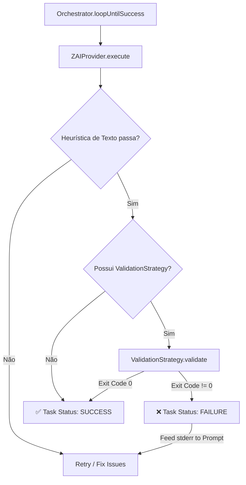

# SPEC_TECNICA: Command Validation Strategy

> Gerado pelo Architect (Anti-Vibe Workflow) - 2026-02-04
> Repositório: https://github.com/RenyEnnos/ouroboros-runtime

## 1. Protocolo de Segurança

Antes de permitir que o orquestrador execute comandos no shell, as seguintes regras devem ser impostas:

### 1.1 Princípio do Comando Definido
O comando a ser executado (ex: `bun test`) deve ser definido **estaticamente** na configuração da tarefa ou da estratégia, e **NUNCA** gerado dinamicamente pelo LLM. Isso previne injeção de comandos arbitrários.

### 1.2 Isolamento de Diretório
A execução deve ser restrita estritamente ao `workDir` especificado na tarefa.

### 1.3 Mascaramento de Saída
Logs de execução (stdout/stderr) devem ser sanitizados para evitar o vazamento de segredos ou chaves de API presentes no ambiente.

---

## 2. Arquitetura da Solução

Atualmente, o `Orchestrator` avalia o sucesso baseando-se apenas em heurísticas de texto (`SUCCESS_INDICATORS`). A nova arquitetura introduz uma camada de validação **"pós-heurística"**.

> Se o agente diz que terminou ("DONE"), nós não acreditamos cegamente. Rodamos uma `ValidationStrategy`. Se o comando falhar (exit code != 0), a tarefa é considerada falha, e o stderr é devolvido ao agente como feedback para a próxima tentativa de auto-correção.

### Diagrama de Fluxo Atualizado



---

## 3. Lista de Tarefas Atômicas (Step-by-Step)

### 3.1 Refinamento de Tipos

**Arquivo:** `cli/src/orchestration/types.ts`

```typescript
/**
 * Contexto de validação passado para a estratégia.
 */
export interface ValidationContext {
    workDir: string;
    taskId: string;
    output: string;
}

/**
 * Resultado da validação.
 */
export interface ValidationResult {
    isValid: boolean;
    message?: string;
    exitCode?: number;
}

/**
 * Interface para estratégias de validação programática.
 */
export interface ValidationStrategy {
    validate(context: ValidationContext): Promise<ValidationResult>;
}

/**
 * Atualizar OrchestratorTask para incluir estratégia opcional.
 */
export interface OrchestratorTask {
    id: string;
    instruction: string;
    persona: PersonaType;
    context?: string;
    workDir?: string;
    validationStrategy?: ValidationStrategy; // NOVO
}
```

---

### 3.2 Implementação da Estratégia

**Arquivo:** `cli/src/orchestration/strategies/CommandValidationStrategy.ts`

```typescript
import { exec } from "node:child_process";
import { promisify } from "node:util";
import type { ValidationStrategy, ValidationContext, ValidationResult } from "../types.js";

const execAsync = promisify(exec);

/**
 * Estratégia que valida executando um comando shell.
 * Sucesso = exit code 0.
 */
export class CommandValidationStrategy implements ValidationStrategy {
    private command: string;
    private timeoutMs: number;

    constructor(command: string, timeoutMs = 30000) {
        this.command = command;
        this.timeoutMs = timeoutMs;
    }

    async validate(context: ValidationContext): Promise<ValidationResult> {
        try {
            const { stdout, stderr } = await execAsync(this.command, {
                cwd: context.workDir,
                timeout: this.timeoutMs,
            });

            return {
                isValid: true,
                exitCode: 0,
                message: stdout || "Validation passed.",
            };
        } catch (error: unknown) {
            const execError = error as { code?: number; stderr?: string; stdout?: string };
            
            return {
                isValid: false,
                exitCode: execError.code ?? 1,
                message: execError.stderr || execError.stdout || String(error),
            };
        }
    }
}

/**
 * Factory para criar estratégia de testes.
 */
export function createTestValidationStrategy(): CommandValidationStrategy {
    return new CommandValidationStrategy("bun test", 60000);
}
```

---

### 3.3 Integração no Loop Principal

**Arquivo:** `cli/src/orchestration/Orchestrator.ts`

Modificar o método `loopUntilSuccess` para executar validação após heurística:

```typescript
// Dentro do bloco de sucesso da heurística
if (evaluation.status === TaskStatus.SUCCESS) {
    // NOVO: Validação programática (se disponível)
    if (task.validationStrategy) {
        this.log(`🔬 Running programmatic validation...`);
        
        const validationResult = await task.validationStrategy.validate({
            workDir: task.workDir || process.cwd(),
            taskId: task.id,
            output: result.output,
        });

        if (!validationResult.isValid) {
            this.log(`❌ Validation failed: ${validationResult.message}`);
            lastError = validationResult.message;
            retryCount++;
            continue; // Volta para o loop
        }
        
        this.log(`✅ Validation passed!`);
    }

    // Código existente de sucesso...
    const taskResult: TaskResult = { ... };
    this.memory.saveTaskResult(task.id, taskResult);
    return taskResult;
}
```

---

## 4. Plano de Verificação (Definition of Done)

### 4.1 Teste: Sucesso Validado
- Task com comando `echo "success"` deve retornar `TaskStatus.SUCCESS`
- Exit code deve ser 0

### 4.2 Teste: Falha de Validação (Auto-correção)
- Task que retorna "DONE" no texto mas falha no comando (ex: `ls arquivo_inexistente`)
- Deve ser marcada como `FAILURE`
- Deve iniciar nova tentativa com o erro no contexto

### 4.3 Teste: Segurança de Diretório
- Garantir que o comando respeite o `workDir`
- Comandos que tentam navegar fora do workDir devem falhar

### 4.4 Comandos de Verificação

```bash
# Rodar testes unitários
bun test

# Verificar tipos
bun run typecheck

# Teste E2E (smoke test)
bun run cli/src/orchestration/smoke-test.ts
```

---

## 5. Arquivos a Criar/Modificar

| Ação | Arquivo |
|------|---------|
| MODIFICAR | `cli/src/orchestration/types.ts` |
| CRIAR | `cli/src/orchestration/strategies/CommandValidationStrategy.ts` |
| CRIAR | `cli/src/orchestration/strategies/index.ts` |
| MODIFICAR | `cli/src/orchestration/Orchestrator.ts` |
| MODIFICAR | `cli/src/orchestration/index.ts` |
| CRIAR | `cli/src/orchestration/Orchestrator.validation.test.ts` |

---

## 6. Próximos Passos

1. ✅ Implementar `CommandValidationStrategy`
2. [ ] Integrar no Orchestrator
3. [ ] Criar testes de validação
4. [ ] Smoke test E2E
5. [ ] Integrar HumanLayer SDK
