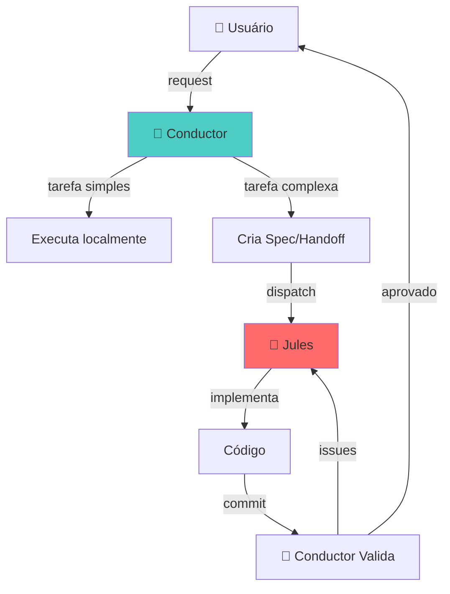

# 🎻 Conductor + Jules: Orquestração para Ouroboros
> **Status: Legacy** — Classificado em [docs/LEGACY_MATRIX.md](docs/LEGACY_MATRIX.md).
> Este guia descreve a orquestração Conductor/Jules via bridges diretas e
> workflow de personas (classificação: ADAPT/MOVE, itens 10-12 da matriz).
> Direção: capability/connector versionado (#63); software work pertence ao Runstead.
>
> **Current/Direction/Legacy**: ver [docs/ARCHITECTURE.md](docs/ARCHITECTURE.md).

> **Guia de Integração para trabalho conjunto via Gemini CLI**

---

## 📋 Visão Geral

Este documento define como **Conductor** e **Jules** devem colaborar no projeto Ouroboros Runtime.

| Agente | Papel | Força |
|--------|-------|-------|
| **Conductor** | Orquestrador (síncrone) | Tarefas interativas, navegação, coordenação, reviews |
| **Jules** | Implementador (assíncrono) | Tarefas extensas de código, refatorações, implementações |

---

## 🎯 Divisão de Responsabilidades

### Conductor (Gemini CLI Interativo)

**USE PARA:**
- ✅ Pesquisa e exploração de código
- ✅ Design e arquitetura (consultas rápidas)
- ✅ Code review e quality gates
- ✅ Debugging interativo
- ✅ Criação de specs e planos
- ✅ Coordenação e handoffs para Jules
- ✅ Testes e validação final

**NÃO USE PARA:**
- ❌ Implementações longas (>100 linhas)
- ❌ Refatorações em múltiplos arquivos
- ❌ Tasks que podem ser background

### Jules (Assíncrono via Gemini CLI Extension)

**USE PARA:**
- ✅ Implementações de features completas
- ✅ Refatorações em larga escala
- ✅ Criação de novos módulos
- ✅ Testes automatizados extensivos
- ✅ Migrações de código
- ✅ Tasks demoradas que não precisam de interação

**NÃO USE PARA:**
- ❌ Exploração de código
- ❌ Perguntas rápidas
- ❌ Tasks que precisam de feedback humano imediato

---

## 🔄 Workflow de Colaboração



---

## 📁 Arquivos de Configuração

### Para Conductor

O Conductor usa os arquivos em `.agent/`:

```
.agent/
├── rules.md              # Regras do workspace
├── workflows/            # Workflows disponíveis
│   ├── implementation.md
│   ├── multi-agent-task.md
│   └── architect-spec.md
├── skills/               # Skills disponíveis
└── prompts/              # Templates de prompt
```

### Para Jules

Jules usa os arquivos em `.jules/`:

```
.jules/
├── HANDOFF_JULES.md     # Template de handoff
└── bolt.md              # Configurações
```

---

## 📝 Como Criar um Handoff para Jules

Quando Conductor identificar uma tarefa para Jules:

### 1. Criar arquivo de handoff

```markdown
# 🤖 Jules Handoff: [Nome da Task]

> **Status:** Ready for Jules  
> **Priority:** [High/Medium/Low]  
> **Type:** [Implementation/Refactor/Test/etc]  
> **Date:** [YYYY-MM-DD]

---

## 📋 Contexto
[Background necessário para entender a task]

---

## 🎯 Objetivo
[O que deve ser alcançado - seja específico]

---

## ✅ Tasks para Jules

### Task 1: [Nome]
**Arquivo:** `[path/to/file]`

**O que fazer:**
[Instruções detalhadas com código se necessário]

**Como testar:**
```bash
[comandos de teste]
```

### Task 2: [Nome]
[...]

---

## 🧪 Checklist de Validação Final
```bash
# Comandos para Jules validar antes de completar
bun run build
bun run test
```

---

## ⚠️ Notas Importantes
- [Restrição 1]
- [Restrição 2]
```

### 2. Salvar em `.jules/`

```bash
# Exemplo
.jules/HANDOFF_feature_xyz.md
```

### 3. Dispatch via Gemini CLI

```bash
# Via extensão Jules do Gemini CLI
gemini jules dispatch .jules/HANDOFF_feature_xyz.md
```

---

## 🔧 Comandos Úteis

### Conductor (Gemini CLI)

```bash
# Iniciar sessão
gemini

# Rodar com contexto específico
gemini --context .agent/rules.md

# Ver status de tasks Jules
gemini jules status
```

### Jules

```bash
# Dispatch task
gemini jules dispatch <handoff-file>

# Ver tasks pendentes
gemini jules list

# Cancelar task
gemini jules cancel <task-id>
```

---

## 🎭 Skill Activation Map

Conductor deve ativar skills baseado em keywords:

| Trigger | Ação | Quem Executa |
|---------|------|--------------|
| "implementar feature" | `/implementation` workflow | Conductor prepara → Jules executa |
| "múltiplas tasks" | `/multi-agent-task` workflow | Conductor coordena waves |
| "arquitetura/design" | `/architect-spec` workflow | Conductor (Architect review) |
| "refatorar X arquivos" | Handoff para Jules | Jules |
| "debug", "investigar" | Execução local | Conductor |
| "criar MCP/tool" | Skill `mcp-builder` | Conductor + Jules |

---

## ⚡ Quick Reference

### Conductor deve perguntar:

1. **É uma task interativa?** → Conductor faz
2. **Requer >100 linhas de código?** → Jules faz
3. **Afeta múltiplos arquivos?** → Jules faz
4. **Precisa de feedback humano frequente?** → Conductor faz
5. **Pode rodar em background?** → Jules faz

### Checklist pré-handoff:

- [ ] Contexto completo documentado
- [ ] Arquivos afetados listados
- [ ] Critérios de sucesso claros
- [ ] Comandos de teste especificados
- [ ] Restrições documentadas

---

## 📚 Referências

- [AGENTS.md](./AGENTS.md) - Guia geral de desenvolvimento
- [.agent/rules.md](./.agent/rules.md) - Regras do workspace
- [.jules/HANDOFF_JULES.md](./.jules/HANDOFF_JULES.md) - Exemplo de handoff
- [SPEC_OUROBOROS_ENV.md](./SPEC_OUROBOROS_ENV.md) - Ambiente isolado

---

> **Lembre-se:** Conductor orquestra, Jules implementa. Juntos, formam um time eficiente onde cada um faz o que faz melhor! 🐍
