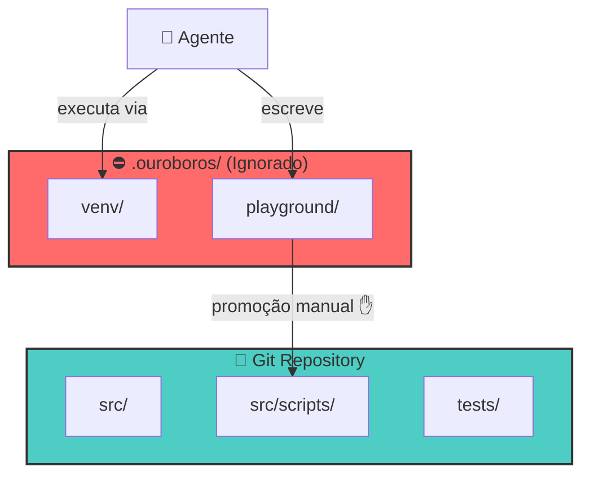

# SPEC: Ouroboros Isolated Environment Architecture

> **Status:** Draft  
> **Author:** DevOps & Security Engineering  
> **Date:** 2026-02-04

---

## 1. Estrutura de Diretórios Proposta

```
Ouroboros/                       # Raiz do projeto (comitável)
├── .ouroboros/                  # ⛔ IGNORADO PELO GIT
│   ├── venv/                    # Ambiente virtual Python isolado
│   └── playground/              # Sandbox para escrita livre do agente
│
├── src/                         # Código-fonte principal
│   ├── agent/                   # Lógica do agente autônomo
│   │   ├── core.py              # Motor principal do agente
│   │   ├── sandbox_runner.py    # Executor de scripts no sandbox
│   │   └── types.py             # Tipos e interfaces
│   │
│   └── scripts/                 # Scripts promovidos (validados)
│       └── __init__.py
│
├── tests/                       # Testes unitários e integração
├── docs/                        # Documentação
├── .gitignore                   # Regras de exclusão Git
├── requirements.txt             # Dependências de produção
├── requirements-dev.txt         # Dependências de desenvolvimento
├── pyproject.toml               # Configuração do projeto Python
└── README.md                    # Documentação principal
```

### Descrição dos Diretórios Críticos

| Diretório | Propósito | Git Status |
|-----------|-----------|------------|
| `.ouroboros/` | Container isolado para runtime do agente | ❌ Ignorado |
| `.ouroboros/venv/` | Ambiente virtual Python exclusivo | ❌ Ignorado |
| `.ouroboros/playground/` | Sandbox de escrita livre para testes | ❌ Ignorado |
| `src/scripts/` | Scripts **promovidos** (validados pelo humano) | ✅ Comitado |

---

## 2. Estratégia de Isolamento (Python Venv)

### 2.1 Criação do Ambiente Virtual

**Windows (PowerShell):**
```powershell
# Criar ambiente virtual isolado
python -m venv .ouroboros/venv

# Ativar ambiente (PowerShell)
.\.ouroboros\venv\Scripts\Activate.ps1

# Ativar ambiente (CMD)
.\.ouroboros\venv\Scripts\activate.bat
```

**Linux/macOS:**
```bash
# Criar ambiente virtual isolado
python3 -m venv .ouroboros/venv

# Ativar ambiente
source .ouroboros/venv/bin/activate
```

### 2.2 Caminhos do Interpretador Python

O agente **DEVE** usar o interpretador do `venv` diretamente, sem depender de ativação manual:

| OS | Caminho do Python | Caminho do Pip |
|----|-------------------|----------------|
| **Windows** | `.ouroboros\venv\Scripts\python.exe` | `.ouroboros\venv\Scripts\pip.exe` |
| **Linux/macOS** | `.ouroboros/venv/bin/python` | `.ouroboros/venv/bin/pip` |

### 2.3 Instalação de Pacotes pelo Agente

> [!CAUTION]
> O agente **NUNCA** deve usar `pip install` diretamente. Sempre usar o caminho completo do pip do venv.

**Comando correto (Windows):**
```powershell
.\.ouroboros\venv\Scripts\pip.exe install <package_name>
```

**Comando correto (Linux/macOS):**
```bash
./.ouroboros/venv/bin/pip install <package_name>
```

### 2.4 Execução de Scripts no Sandbox

```powershell
# Windows - Executar script no playground
.\.ouroboros\venv\Scripts\python.exe .\.ouroboros\playground\my_script.py

# Linux/macOS
./.ouroboros/venv/bin/python ./.ouroboros/playground/my_script.py
```

---

## 3. Regras de Git (.gitignore)

### 3.1 Conteúdo Proposto para `.gitignore`

```gitignore
# ==============================================
# OUROBOROS ISOLATION RULES
# ==============================================

# Ambiente virtual (CRÍTICO - não comitar)
.ouroboros/venv/

# Playground do agente (escrita livre)
.ouroboros/playground/

# Cache e arquivos temporários do agente
.ouroboros/*.log
.ouroboros/*.tmp
.ouroboros/.cache/

# ==============================================
# PYTHON STANDARD
# ==============================================

# Bytecode
__pycache__/
*.py[cod]
*$py.class

# Virtual environments (genérico)
venv/
.venv/
ENV/
env/

# Distribuição
*.egg-info/
dist/
build/
*.egg

# Cache de ferramentas
.pytest_cache/
.mypy_cache/
.ruff_cache/
.coverage
htmlcov/

# ==============================================
# IDE & OS
# ==============================================

# VS Code (exceto configurações úteis)
.vscode/*
!.vscode/settings.json
!.vscode/tasks.json
!.vscode/launch.json
!.vscode/extensions.json

# JetBrains
.idea/

# OS files
.DS_Store
Thumbs.db

# ==============================================
# ENVIRONMENT & SECRETS
# ==============================================

.env
.env.local
.env.*.local
*.pem
*.key
secrets/
```

### 3.2 Workflow de Promoção de Scripts

Quando o agente criar um script útil em `.ouroboros/playground/`, o humano pode **promovê-lo**:

```powershell
# Mover script validado para área comitável
Move-Item .\.ouroboros\playground\useful_script.py .\src\scripts\

# Adicionar ao Git
git add .\src\scripts\useful_script.py
git commit -m "feat: promote agent script - useful_script.py"
```

---

## 4. Integração com o Código Atual

### 4.1 Configuração de Caminhos (config.py)

Criar um módulo de configuração que resolve os caminhos dinamicamente:

```python
# src/agent/config.py
import os
import sys
from pathlib import Path

class OuroborosEnvironment:
    """Gerencia caminhos do ambiente isolado."""
    
    def __init__(self, project_root: Path = None):
        self.project_root = project_root or Path(__file__).parent.parent.parent
        self.ouroboros_dir = self.project_root / ".ouroboros"
        self.venv_dir = self.ouroboros_dir / "venv"
        self.playground_dir = self.ouroboros_dir / "playground"
    
    @property
    def python_executable(self) -> Path:
        """Retorna o caminho do interpretador Python do venv."""
        if sys.platform == "win32":
            return self.venv_dir / "Scripts" / "python.exe"
        return self.venv_dir / "bin" / "python"
    
    @property
    def pip_executable(self) -> Path:
        """Retorna o caminho do pip do venv."""
        if sys.platform == "win32":
            return self.venv_dir / "Scripts" / "pip.exe"
        return self.venv_dir / "bin" / "pip"
    
    def ensure_environment(self) -> bool:
        """Garante que o ambiente existe e está configurado."""
        if not self.venv_dir.exists():
            raise EnvironmentError(
                f"Ouroboros venv não encontrado em {self.venv_dir}. "
                "Execute: python -m venv .ouroboros/venv"
            )
        
        self.playground_dir.mkdir(parents=True, exist_ok=True)
        return True


# Singleton para uso global
ouroboros_env = OuroborosEnvironment()
```

### 4.2 Executor de Sandbox (sandbox_runner.py)

```python
# src/agent/sandbox_runner.py
import subprocess
from pathlib import Path
from typing import Tuple

from .config import ouroboros_env


class SandboxRunner:
    """Executa scripts de forma isolada no playground."""
    
    def __init__(self):
        ouroboros_env.ensure_environment()
    
    def execute_script(
        self, 
        script_path: Path, 
        timeout: int = 30
    ) -> Tuple[int, str, str]:
        """
        Executa um script no ambiente isolado.
        
        Returns:
            Tuple[exit_code, stdout, stderr]
        """
        result = subprocess.run(
            [str(ouroboros_env.python_executable), str(script_path)],
            capture_output=True,
            text=True,
            timeout=timeout,
            cwd=ouroboros_env.playground_dir
        )
        return result.returncode, result.stdout, result.stderr
    
    def install_package(self, package_name: str) -> bool:
        """Instala um pacote no venv isolado."""
        result = subprocess.run(
            [str(ouroboros_env.pip_executable), "install", package_name],
            capture_output=True,
            text=True
        )
        return result.returncode == 0
    
    def write_to_playground(self, filename: str, content: str) -> Path:
        """Escreve um arquivo no playground."""
        file_path = ouroboros_env.playground_dir / filename
        file_path.write_text(content, encoding="utf-8")
        return file_path
```

### 4.3 Script de Bootstrap

```powershell
# scripts/bootstrap_ouroboros.ps1

Write-Host "🐍 Configurando ambiente Ouroboros..." -ForegroundColor Cyan

# Criar estrutura de diretórios
$ouroborosDir = ".\.ouroboros"
New-Item -ItemType Directory -Force -Path "$ouroborosDir\playground" | Out-Null

# Criar venv se não existir
if (-not (Test-Path "$ouroborosDir\venv")) {
    Write-Host "📦 Criando ambiente virtual..." -ForegroundColor Yellow
    python -m venv "$ouroborosDir\venv"
}

# Instalar dependências base
Write-Host "📚 Instalando dependências..." -ForegroundColor Yellow
& "$ouroborosDir\venv\Scripts\pip.exe" install --upgrade pip
& "$ouroborosDir\venv\Scripts\pip.exe" install -r requirements.txt

Write-Host "✅ Ambiente Ouroboros pronto!" -ForegroundColor Green
Write-Host "   Python: $ouroborosDir\venv\Scripts\python.exe" -ForegroundColor Gray
```

---

## 5. Checklist de Implementação

- [ ] Criar `.gitignore` com regras definidas
- [ ] Criar estrutura `.ouroboros/` e `playground/`
- [ ] Executar bootstrap do venv
- [ ] Implementar `config.py` com `OuroborosEnvironment`
- [ ] Implementar `sandbox_runner.py`
- [ ] Testar execução isolada de script simples
- [ ] Documentar workflow de promoção de scripts

---

## 6. Diagrama de Arquitetura



---

> [!IMPORTANT]
> **Regra de Ouro:** O agente **NUNCA** deve escrever diretamente em `src/`. Todo código gerado vai para `.ouroboros/playground/` e só é promovido após validação humana.
