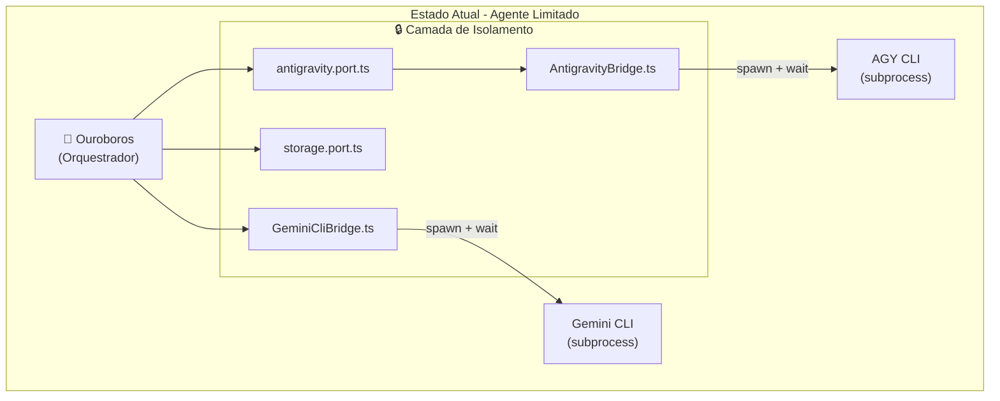

# 🐍 Arquitetura de Autonomia do Agente

> **Análise Crítica: Por que o Agente é "Usuário" e não "Dono" das Ferramentas**

Este documento analisa os bloqueios arquiteturais que impedem o Ouroboros de ter controle total sobre suas ferramentas (Antigravity, Gemini CLI, OpenCode).

---

## 📋 Resumo Executivo

O problema **NÃO** é apenas uma flag de "aprovação humana". O verdadeiro bloqueio é a **Arquitetura Hexagonal** que trata Antigravity, Gemini CLI e OpenCode como "acessórios externos" em vez de extensões do próprio corpo cognitivo do agente.



---

## 🚧 Bloqueios Identificados

### 1. Bridges como "Tradutores Limitadores"

**Localização:** [`cli/src/bridges/AntigravityBridge.ts`](file:///home/pedro/.gemini/antigravity/playground/quantum-shuttle/ouroboros-runtime/cli/src/bridges/AntigravityBridge.ts)

**O Problema:**

```typescript
// Linha 143-147 - Execução via subprocess efêmero
const proc = spawn(command, args, {
    cwd,
    shell: isWindows,
    env: { ...env, PAGER: "cat" },
});
```

O agente executa ferramentas via `child_process.spawn()`. O processo **nasce, executa, e morre**. O agente não mantém a "mão no volante" - ele dá um empurrão e espera passivamente.

**Limitações Concretas:**
- Sem persistência de estado entre chamadas
- Sem acesso ao contexto interno da ferramenta
- Apenas stdout/stderr como feedback
- Reinicialização completa a cada tarefa

> [!CAUTION]
> O padrão atual é "fire-and-forget" - cada chamada é isolada, sem memória entre execuções.

---

### 2. Ports como "Contratos Restritivos"

**Localização:** [`cli/src/ports/antigravity.port.ts`](file:///home/pedro/.gemini/antigravity/playground/quantum-shuttle/ouroboros-runtime/cli/src/ports/antigravity.port.ts)

**O Problema:**

```typescript
// Interface fixa - apenas estes métodos estão disponíveis
export interface AntigravityPort {
    execute(prompt: AntigravityPrompt): Promise<AntigravityResult>;
    getState(): Promise<AntigravityState | null>;
    interrupt(): Promise<void>;
    initialize(config: AntigravityConfig): Promise<void>;
    shutdown(): Promise<void>;
}
```

O `Port` define um **contrato limitado**. O agente só pode interagir através destes 5 métodos. Se a ferramenta tiver funcionalidades avançadas (debugger, REPL interativo, inspeção de estado), o agente é **cego** a elas.

**Limitações Concretas:**
- Sem acesso a APIs internas ou extensões
- Sem possibilidade de enviar código arbitrário
- Sem controle sobre o ciclo de vida do processo
- Abstração "one-size-fits-all" ignora capacidades específicas

---

### 3. Orchestrator com Phase Gates

**Localização:** [`cli/src/orchestration/Orchestrator.ts`](file:///home/pedro/.gemini/antigravity/playground/quantum-shuttle/ouroboros-runtime/cli/src/orchestration/Orchestrator.ts#L395-L406)

**O Problema:**

```typescript
// Linha 395-406 - Validação Anti-Vibe obrigatória
async validatePhase(phase: WorkflowPhase): Promise<void> {
    // Gate blocks execution without approved spec
    // ...
}
```

O `validatePhase` força o agente a passar por estágios de aprovação antes de executar. Isso implementa o **Anti-Vibe Protocol** que exige:

1. Spec Phase → Criação de especificação
2. Validation → Human review gate
3. Implementation → Só após aprovação
4. Verification → Mais validação

> [!WARNING]
> Para autonomia total, o agente precisaria **bypassar** esta validação - o que quebra as garantias de segurança do sistema.

---

### 4. Sandbox Forçado via AGENTS.md

**Localização:** [`AGENTS.md`](file:///home/pedro/.gemini/antigravity/playground/quantum-shuttle/ouroboros-runtime/AGENTS.md#L140-L144)

**As Regras:**

```markdown
### Sandbox Boundaries
- **CAN EDIT**: Any file in `/Ouroboros` root
- **CAN CREATE**: Files in `.ouroboros/` (skills, venv scripts)
- **CANNOT**: Install global packages, modify system configs
- **MUST**: Use `.ouroboros/venv` for Python execution (isolated)
```

O agente roda Python em um **virtualenv isolado**. Isso impede:
- Modificação do ambiente Node.js do próprio Ouroboros
- Instalação de dependências globais
- Alteração de configurações do sistema operacional
- **Self-modification** do código dos bridges

---

## 🔓 Plano de "Posse" (Autonomia Total)

Para que o agente deixe de ser "usuário" e passe a ser "dono":

### Fase 1: REPL Persistente

```diff
// AntigravityBridge.ts - De subprocess efêmero...
- const proc = spawn(command, args, { ... });
- // wait for completion
- // process dies

// ...para daemon interativo
+ private persistentProcess: ChildProcess | null = null;
+ 
+ async startDaemon(): Promise<void> {
+     this.persistentProcess = spawn('python3', ['-i'], {
+         stdio: ['pipe', 'pipe', 'pipe']
+     });
+ }
+ 
+ async injectCode(code: string): Promise<string> {
+     this.persistentProcess.stdin.write(code + '\n');
+     // read response from stdout
+ }
```

**Benefício:** O agente mantém canal aberto, injeta código em tempo real, sem reiniciar.

---

### Fase 2: SDK Nativo vs CLI

```diff
// Atual: CLI wrapper
- const proc = spawn('gemini', ['--prompt', prompt]);

// Ideal: SDK direto
+ import { GoogleGenerativeAI } from '@google/generative-ai';
+ const genAI = new GoogleGenerativeAI(process.env.GEMINI_API_KEY);
+ const model = genAI.getGenerativeModel({ model: 'gemini-pro' });
+ const result = await model.generateContent(prompt);
```

**Benefício:** Controle total sobre headers, streaming, contexto de sessão.

---

### Fase 3: Bypass do Anti-Vibe

```diff
// Orchestrator.ts
async validatePhase(phase: WorkflowPhase): Promise<void> {
-   if (requiresApproval(phase)) {
-       await this.waitForHumanApproval();
-   }
+   // AUTONOMOUS MODE: Skip validation
+   if (this.config.autonomousMode) {
+       this.log('warn', 'Bypassing phase validation (autonomous mode)');
+       return;
+   }
    // ... existing validation
}
```

> [!CAUTION]
> Isso remove garantias de segurança. O agente pode executar código imediatamente após "pensar" nele.

---

### Fase 4: Self-Modification

Permitir que o agente edite seus próprios bridges:

```typescript
// Novo: AgentMetaController
class AgentMetaController {
    async rewriteBridge(bridgeName: string, newCode: string): Promise<void> {
        const bridgePath = `cli/src/bridges/${bridgeName}.ts`;
        await fs.writeFile(bridgePath, newCode);
        // Hot reload or restart
    }
}
```

---

## 📊 Comparativo: Estado Atual vs Estado Desejado

| Aspecto | Estado Atual | Estado "Posse Total" |
|---------|--------------|---------------------|
| Execução de ferramentas | Subprocess efêmero | Daemon persistente + REPL |
| Interface | Port abstrato limitado | Acesso direto a SDK/API |
| Validação | Phase gates obrigatórios | Bypass configurável |
| Self-modification | Proibido por sandbox | Permitido com hot-reload |
| Contexto entre chamadas | Nenhum (stateless) | Memória completa |
| Controle de processo | Fire-and-forget | Canal bidirecional |

---

## ⚠️ Riscos da Autonomia Total

> [!CAUTION]
> **Estes riscos são reais e devem ser considerados:**

1. **Loops destrutivos**: Sem human-in-the-loop, o agente pode entrar em loops de auto-modificação que corrompem o sistema
2. **Escalação de privilégios**: Acesso irrestrito permite modificar configurações de segurança
3. **Perda de auditoria**: Sem phase gates, não há registro de aprovações
4. **Instabilidade**: Hot-reload de bridges pode causar estados inconsistentes

---

## 🎯 Conclusão

O código atual **protege as ferramentas DO agente**. A arquitetura hexagonal com ports, bridges e phase gates foi desenhada **intencionalmente** para impedir acoplamento profundo.

Para "posse total", seria necessário:

1. ~~Destruir Adapters~~ → Chamar APIs diretamente
2. ~~Implementar REPL Persistente~~ → Manter canal aberto com ferramentas
3. ~~Bypass Anti-Vibe~~ → Remover `validatePhase` checks
4. ~~Habilitar Self-Modification~~ → Permitir edição dos próprios bridges

**Trade-off fundamental:** Segurança e previsibilidade vs Autonomia e poder.

---

*Documento gerado em: 2026-02-08*
*Análise baseada no código-fonte do Ouroboros Runtime*
